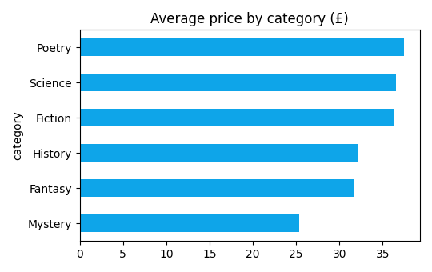
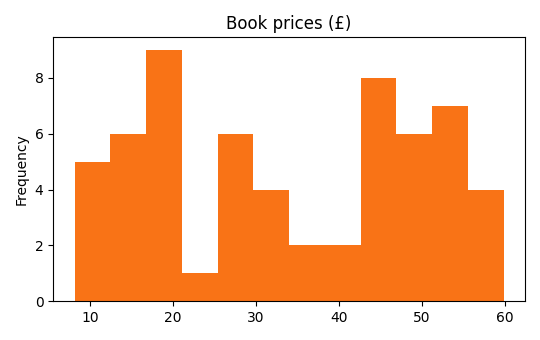
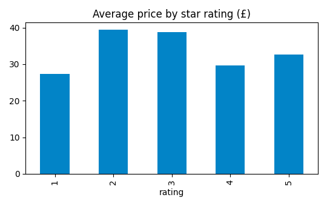

# Mini Bookstore Price Study

**Question:** what do books cost, and does a better rating mean a higher price?

**Method:** scraped 60 books (3 pages) with Crawl4AI from our practice
bookstore, cleaned the data with pandas, charted it with matplotlib.

## Findings
1. The average book costs **£34.02**.
2. Price vs rating correlation is **0.01** — better-rated books are
   NOT more expensive.
3. The biggest category is **Science** with 14 books.

*Data source: local practice site (structure of books.toscrape.com).*
