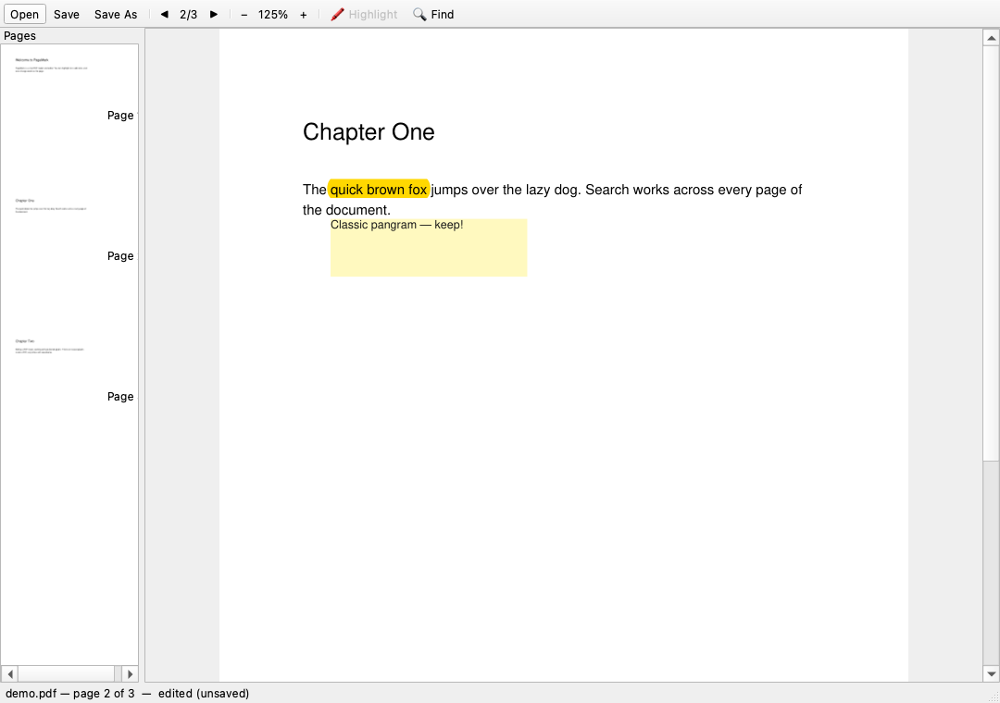

# PageMark — PDF reader & editor (task-22)

A desktop PDF app that reads **and edits**: open, zoom, search, highlight,
sticky notes, and in-place text replacement — built the task-22 way
(design doc → tests first → small tasks). ~700 lines, 18 tests.



| | |
|---|---|
| UI | PySide6 (Qt 6) — native windows on Windows / macOS / Linux |
| PDF engine | PyMuPDF — renders pages *and* rewrites content |
| Tests | pytest — the whole core runs without opening a window |

The design rule that makes it testable: **Qt only displays.** Everything
real lives in [pdf_document.py](pdf_document.py), which never imports Qt.

## Run it

```bash
python3 -m venv .venv
.venv/bin/pip install -r requirements.txt
.venv/bin/python main.py            # or: main.py some-file.pdf
```

Try it: drag-select text → **Highlight** · double-click a word → edit it ·
right-click → add a note · Ctrl+F → search · Ctrl+S → save.

> ⚠️ Keep the project on a normal disk path. Cloud-synced folders
> (iCloud Drive/OneDrive) can break Qt's plugin loading — if you see
> "could not find the Qt platform plugin", move the folder or set
> `QT_QPA_PLATFORM_PLUGIN_PATH` to a local copy of
> `PySide6/Qt/plugins/platforms`.

## Test it

```bash
.venv/bin/pytest          # 18 tests: core engine + offscreen GUI smoke
```

Every edit is verified the honest way: do it → save → **reopen → assert**.

## Build the Windows .exe

```powershell
pip install pyinstaller
pyinstaller --noconsole --onedir --name PageMark main.py
# → dist/PageMark/PageMark.exe  (test it on a machine without Python!)
```

## Design

See [task-22.md](task-22.md) — including the Adobe-vs-MVP feature map and
why "edit PDF text" really means *redact glyphs + insert at the baseline*.
